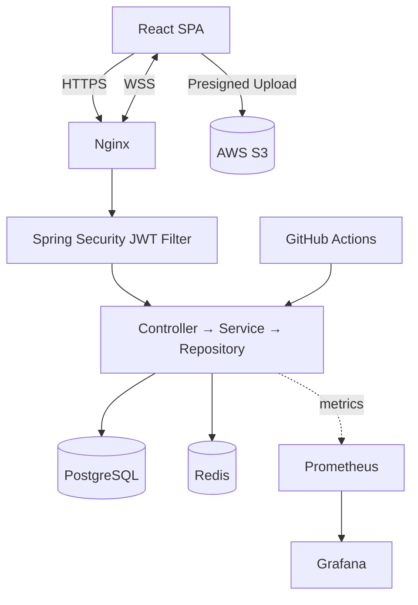
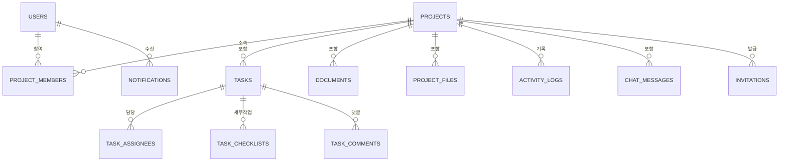

# TeamFlow

웹 기반 팀 프로젝트 협업 플랫폼 — Task, 일정, 문서, 파일, 댓글, 실시간 알림, 채팅, 진행률 통계를 하나의 서비스로 통합 관리합니다.

**배포**: 아직 배포 전입니다 — Phase 10(Deployment/Monitoring)에서 진행 예정입니다. 상세는 [20-development-roadmap.md](./docs/20-development-roadmap.md) 참고.

> 본 프로젝트는 기업 취업 포트폴리오용 개인 프로젝트이며, 단순 CRUD를 넘어 실무 환경에서 요구되는 인증/인가, 실시간 통신, 캐싱, 파일 업로드, 테스트 자동화, CI/CD, 모니터링을 통합적으로 다룹니다. 상세 설계는 [docs/](./docs) 디렉터리의 20개 기준 문서(Source of Truth)를 참고하세요.

## Problem

팀 프로젝트를 진행할 때 Task 관리, 일정, 문서, 파일, 커뮤니케이션이 서로 다른 도구에 분산되어 맥락 전환 비용이 크고, 권한 관리나 변경 이력 추적이 되지 않아 협업 신뢰도가 떨어집니다.

## Solution

TeamFlow는 Kanban 기반 Task 관리, RBAC 권한 관리, 실시간 알림/채팅, 문서/파일 관리, 활동 기록, Dashboard 통계를 하나의 화면에서 제공하여 팀이 여러 도구를 오가지 않고 프로젝트를 운영할 수 있게 합니다.

## Key Features

- 팀 프로젝트 생성/관리(Soft Delete), 팀원 초대·소유권 위임 및 RBAC 권한 관리 (OWNER/ADMIN/MEMBER/GUEST)
- Kanban 기반 Task 관리 (상태/우선순위/담당자/Checklist, Drag & Drop)
- Task 댓글 및 `@Mention`
- 실시간 알림 (SSE) / 실시간 프로젝트 채팅 (WebSocket)
- 프로젝트 일정(Calendar), 문서, 파일(S3 Presigned URL) 관리
- 프로젝트 활동 기록(ActivityLog) 및 진행률 Dashboard
- 검색/필터, JWT 인증, 테스트 자동화, CI/CD, Prometheus/Grafana 모니터링

전체 기능 요구사항은 [02-requirements-specification.md](./docs/02-requirements-specification.md), 기능 상세는 [03-functional-specification.md](./docs/03-functional-specification.md)를 참고하세요.

## Architecture

Backend는 **Modular Monolith**(Spring Boot 단일 애플리케이션 + Domain별 Package 분리)로 구성합니다. MSA/Kubernetes/Kafka는 현재 규모에 과도하다고 판단해 도입하지 않았습니다.



상세 아키텍처: [04-system-architecture.md](./docs/04-system-architecture.md) · [05-backend-architecture.md](./docs/05-backend-architecture.md) · [06-frontend-architecture.md](./docs/06-frontend-architecture.md)

## Technology Stack

| 영역 | 기술 |
|---|---|
| Frontend | React, TypeScript, Vite, React Query, Tailwind CSS |
| Backend | Java, Spring Boot, Spring Security, Spring Data JPA |
| 인증 | JWT (Access/Refresh Token), RBAC |
| Database | PostgreSQL |
| Cache / Pub-Sub | Redis |
| 실시간 통신 | SSE (알림), WebSocket (채팅) |
| File Storage | AWS S3 (Presigned URL) |
| Search | PostgreSQL 검색 (→ Elasticsearch 확장 가능) |
| Infra | Docker, Docker Compose, Nginx, AWS EC2 |
| CI/CD | GitHub Actions |
| Monitoring | Prometheus, Grafana |
| Test | JUnit, Mockito, Testcontainers, Playwright |

## ERD



전체 ERD와 Table 정의(PK/FK/Index/Delete Policy)는 [07-database-design.md](./docs/07-database-design.md)를 참고하세요.

## Main API

| Method | Endpoint | 설명 |
|---|---|---|
| POST | `/api/auth/login` | 로그인, JWT 발급 |
| POST | `/api/projects` | 프로젝트 생성 |
| POST | `/api/projects/{projectId}/invitations` | 팀원 초대 |
| PATCH | `/api/projects/{projectId}/members/{id}/transfer-ownership` | 프로젝트 소유권 위임 |
| POST | `/api/projects/{projectId}/tasks` | Task 생성 |
| PATCH | `/api/projects/{projectId}/tasks/{taskId}/status` | Task 상태 변경 (Kanban, 낙관적 락 검증) |
| POST | `/api/tasks/{taskId}/comments` | 댓글 작성 (Mention 지원) |
| GET | `/api/notifications/subscribe` | 실시간 알림 (SSE) |
| WS | `/ws/chat` | 실시간 채팅 (WebSocket) |
| POST | `/api/projects/{projectId}/files/presigned-url` | 파일 업로드 URL 발급 |
| GET | `/api/projects/{projectId}/dashboard` | 진행률 통계 조회 |

전체 API 명세: [08-api-specification.md](./docs/08-api-specification.md)

## Technical Challenges

각 항목은 `문제 → 원인 → 해결 방법 → 적용 기술 → 검증 방법 → 결과` 순서로 정리했습니다. (실제 구현 시 이 문서를 기준으로 작성/검증합니다.)

### 1. 동시 Task 수정 (Concurrent Update)

- **문제**: 두 사용자가 동시에 같은 Task 상태를 변경하면 나중 요청이 먼저 요청을 덮어써 데이터 정합성이 깨질 수 있다.
- **원인**: Kanban Board는 Drag & Drop으로 상태 변경이 잦고, 여러 팀원이 동시에 같은 프로젝트를 보는 것이 일반적인 사용 패턴이다.
- **해결 방법**: JPA `@Version` 기반 Optimistic Locking을 Task Entity에 적용, 충돌 시 409(`TASK_VERSION_CONFLICT`)를 반환하고 Frontend가 최신 상태로 재조회 후 재시도를 안내한다.
- **적용 기술**: Spring Data JPA `@Version`, `OptimisticLockingFailureException` 처리
- **검증 방법**: Integration Test에서 동일 Task에 대해 두 트랜잭션을 동시에 커밋 시도하여 하나는 성공, 하나는 충돌 예외가 발생하는지 검증
- **결과(목표)**: 데이터 유실 없이 충돌을 감지하고, 사용자에게 명확한 재시도 경로를 제공

### 2. 권한 관리 (RBAC + 프로젝트 단위 권한)

- **문제**: 전역 Role만으로는 "프로젝트 A에서는 ADMIN이지만 프로젝트 B에서는 MEMBER"인 상황을 표현할 수 없다.
- **원인**: 한 사용자가 여러 프로젝트에 서로 다른 Role로 참여할 수 있는 구조적 요구사항.
- **해결 방법**: Role을 User가 아닌 `ProjectMember`(User-Project 관계)에 귀속시키고, 모든 프로젝트 하위 API에서 `ProjectPermissionChecker`로 "요청자가 해당 프로젝트 멤버인지 + Role이 요구 등급 이상인지"를 일관되게 검증한다.
- **적용 기술**: Spring Security + 커스텀 권한 검증 컴포넌트, Enum 기반 Role 등급 비교
- **검증 방법**: API Test에서 각 Role × 각 API 조합의 허용/거부 매트릭스를 케이스로 작성 ([09-authentication-authorization.md](./docs/09-authentication-authorization.md) 권한 매트릭스 기준)
- **결과(목표)**: 프로젝트 단위로 독립적인 권한 모델을 일관된 코드 경로로 검증

### 3. JPA N+1 문제

- **문제**: Task 목록 조회 시 각 Task의 담당자/Checklist를 개별 쿼리로 조회하면 목록 크기에 비례해 쿼리 수가 폭증한다.
- **원인**: JPA 기본 Lazy Loading에서 연관 엔티티를 반복문 내에서 접근할 때 발생하는 전형적인 패턴.
- **해결 방법**: 목록 조회 API는 `fetch join` 또는 `@EntityGraph`로 필요한 연관을 한 번에 조회하고, 컬렉션(Checklist 등) 다중 fetch join으로 인한 페이징 이슈는 `BatchSize`(`default_batch_fetch_size`)로 보완한다.
- **적용 기술**: Spring Data JPA `@EntityGraph`, QueryDSL fetch join, Hibernate `default_batch_fetch_size`
- **검증 방법**: Integration Test에서 Hibernate Statistics(쿼리 실행 횟수)를 확인하여 목록 크기와 무관하게 쿼리 수가 고정되는지 검증
- **결과(목표)**: Task 목록 API의 쿼리 수를 N+1에서 상수 수준으로 감소

### 4. 실시간 알림 (SSE)

- **문제**: Task 배정/Mention 등 이벤트 발생을 폴링 없이 즉시 사용자에게 전달해야 한다.
- **원인**: REST 폴링은 지연이 발생하고 불필요한 요청이 많아진다.
- **해결 방법**: 사용자별 `SseEmitter`를 유지하고, 이벤트 발생 시 Redis Pub/Sub을 경유해 해당 사용자 채널로 전달한다 ([10-realtime-architecture.md](./docs/10-realtime-architecture.md) 참고). 연결 유지를 위한 heartbeat와 클라이언트 자동 재연결 + REST 보완 조회로 유실을 방지한다.
- **적용 기술**: Spring `SseEmitter`, Redis Pub/Sub, `EventSource`
- **검증 방법**: E2E Test로 "Task 배정 시 담당자 화면에 3초 이내 알림이 표시된다"를 검증
- **결과(목표)**: 폴링 없이 이벤트 발생 즉시(초 단위) 알림 전달

### 5. Redis Cache 적용

- **문제**: Dashboard 통계처럼 집계 비용이 큰 조회가 반복되면 PostgreSQL 부하가 커진다.
- **원인**: 매 요청마다 Task/Member를 집계하는 쿼리를 실행하는 구조.
- **해결 방법**: Cache-Aside 패턴으로 Dashboard/프로젝트 정보를 Redis에 캐싱하고, 관련 데이터 변경 시 캐시를 명시적으로 Evict한다 ([12-cache-redis-design.md](./docs/12-cache-redis-design.md) 참고).
- **적용 기술**: Spring Cache Abstraction + Redis, TTL 기반 자동 만료
- **검증 방법**: Integration Test로 캐시 Hit 시 DB 쿼리가 실행되지 않는지, 데이터 변경 후 캐시가 Evict되어 최신 값을 반환하는지 검증
- **결과(목표)**: Dashboard 조회의 반복 요청에서 DB 쿼리 횟수 감소

### 6. 대량 알림 처리

- **문제**: 공지사항처럼 프로젝트 전체 팀원에게 알림을 보낼 때 팀원 수만큼 동기 처리하면 요청 처리 시간이 길어진다.
- **원인**: Notification 생성(DB 저장) + SSE 전송을 하나의 요청 트랜잭션에서 순차 처리하는 구조의 한계.
- **해결 방법**: Notification 저장은 Batch Insert로 처리하고, SSE 전송은 요청 트랜잭션 커밋 이후(`@TransactionalEventListener(AFTER_COMMIT)`) 비동기(`@Async`)로 수행하여 API 응답 지연과 분리한다.
- **적용 기술**: Spring `@Async`, `@TransactionalEventListener`, JDBC Batch Insert
- **검증 방법**: 팀원 N명 기준 알림 발송 API의 응답 시간이 N에 비례해 증가하지 않는지 성능 테스트로 확인
- **결과(목표)**: 알림 발송이 API 응답 지연에 영향을 주지 않도록 분리

### 7. 파일 업로드 (대용량 파일)

- **문제**: 서버를 경유한 파일 업로드는 서버 메모리/네트워크 부하를 유발하고 확장성이 떨어진다.
- **원인**: Multipart 업로드를 Backend가 직접 처리하면 파일 크기·동시 업로드 수에 서버 리소스가 비례한다.
- **해결 방법**: AWS S3 Presigned URL 방식으로 Client가 S3에 직접 업로드하고, Backend는 URL 발급과 메타데이터 등록만 담당한다 ([11-file-storage-design.md](./docs/11-file-storage-design.md) 참고).
- **적용 기술**: AWS SDK Presigned URL, S3 Private Bucket
- **검증 방법**: 업로드 중 Backend 프로세스의 메모리/CPU 사용량이 파일 크기와 무관하게 일정한지 확인
- **결과(목표)**: 서버 리소스 소모 없이 대용량 파일 업로드 지원

### 8. Transaction 경계 설계

- **문제**: Task 생성 → ActivityLog 기록 → Notification 생성이 하나의 트랜잭션에 묶이면, Notification 처리 실패가 Task 생성 자체를 롤백시킬 수 있다.
- **원인**: 핵심 도메인 로직과 부가 효과(Audit, 알림)를 하나의 트랜잭션/Service 호출로 결합한 설계.
- **해결 방법**: 핵심 로직(Task 저장)만 트랜잭션으로 묶고, ActivityLog/Notification은 `ApplicationEvent`로 발행하여 `AFTER_COMMIT` 시점에 별도로 처리한다 ([05-backend-architecture.md](./docs/05-backend-architecture.md) 3.1절 참고). 부가 효과 실패는 별도 로깅으로 격리하고 핵심 트랜잭션에 영향을 주지 않는다.
- **적용 기술**: Spring `@Transactional`, `ApplicationEventPublisher`, `@TransactionalEventListener`
- **검증 방법**: Notification 처리 중 강제 예외를 발생시켜도 Task 저장은 커밋되어 있는지 Integration Test로 검증
- **결과(목표)**: 핵심 트랜잭션과 부가 효과의 장애 격리

### 9. 데이터 정합성 (Cache/실시간 데이터와 DB 간)

- **문제**: Redis 캐시, SSE로 전달된 알림 상태와 실제 DB 상태가 어긋날 수 있다 (예: 캐시 Evict 누락, SSE 유실).
- **원인**: 여러 저장소(DB/Cache/클라이언트 메모리)에 상태가 분산되어 있어 갱신 타이밍 차이가 발생한다.
- **해결 방법**: DB를 항상 Source of Truth로 두고, 캐시는 짧은 TTL + 명시적 Evict를 병행(정합성이 잠깐 깨져도 자동 복구), SSE는 REST 폴백 조회로 최종 정합성을 보장한다 ([12-cache-redis-design.md](./docs/12-cache-redis-design.md), [10-realtime-architecture.md](./docs/10-realtime-architecture.md) 참고).
- **적용 기술**: Cache-Aside + TTL, SSE 재연결 시 REST 보완 조회
- **검증 방법**: 캐시 Evict 누락을 시뮬레이션한 상태에서 TTL 경과 후 최신 데이터로 자동 복구되는지 검증
- **결과(목표)**: 일시적 불일치는 허용하되(Eventually Consistent), 일정 시간 내 자동으로 정합성 회복

## Testing

Unit(JUnit/Mockito) → Integration(Testcontainers) → API(Controller) → E2E(Playwright) 순서의 테스트 피라미드를 따릅니다. 상세: [15-test-strategy.md](./docs/15-test-strategy.md)

## CI/CD

GitHub Actions로 Push → Build → Test → Docker Image Build(GHCR) → Deploy(EC2 SSH) → Health Check → 실패 시 Rollback 파이프라인을 구성합니다([ci.yml](./.github/workflows/ci.yml), [deploy.yml](./.github/workflows/deploy.yml)). 이미지 빌드/푸시는 Secrets 없이도 동작하며, EC2 배포 단계는 `EC2_HOST`/`EC2_SSH_KEY` 등 Repository Secrets가 설정된 경우에만 실행됩니다(미설정 시 자동으로 건너뜀 — 실제 EC2 인스턴스는 아직 준비되지 않았습니다). 상세: [14-ci-cd-design.md](./docs/14-ci-cd-design.md)

## Monitoring

Prometheus가 `/actuator/prometheus`(API/JVM/DB Pool)와 postgres_exporter/redis_exporter/node_exporter(DB/Redis/서버 리소스) 지표를 수집하고, Grafana가 [teamflow-overview 대시보드](./monitoring/grafana/dashboards/teamflow-overview.json)로 자동 프로비저닝되어 시각화합니다. `docker-compose.prod.yml`로 로컬에서 전체 스택을 기동해 실시간 지표가 표시되는 것까지 직접 확인했습니다. 상세: [16-monitoring-design.md](./docs/16-monitoring-design.md)

## Directory Structure

```
project-root/
├── docs/                              설계 기준 문서 (Source of Truth)
│   ├── 01-project-overview.md
│   ├── 02-requirements-specification.md
│   ├── 03-functional-specification.md
│   ├── 04-system-architecture.md
│   ├── 05-backend-architecture.md
│   ├── 06-frontend-architecture.md
│   ├── 07-database-design.md
│   ├── 08-api-specification.md
│   ├── 09-authentication-authorization.md
│   ├── 10-realtime-architecture.md
│   ├── 11-file-storage-design.md
│   ├── 12-cache-redis-design.md
│   ├── 13-infrastructure-design.md
│   ├── 14-ci-cd-design.md
│   ├── 15-test-strategy.md
│   ├── 16-monitoring-design.md
│   ├── 17-security-design.md
│   ├── 18-error-handling-policy.md
│   ├── 19-logging-audit-policy.md
│   ├── 20-development-roadmap.md
│   ├── 21-free-deployment-guide.md    카드 등록 없이 Render+Neon+Upstash로 무료 배포하는 절차
│   └── diagrams/wireframes/           화면 설계 목업 이미지 (06번 문서 8장에서 참조)
├── backend/                           Spring Boot (Modular Monolith) — Phase 10(Deployment/Monitoring) 완료
│   ├── src/main/java/com/teamflow/    auth/user/project/member/task/comment/notification/
│   │                                  chat/document/file/activity/dashboard/common 13개 Domain Package
│   ├── src/test/java/com/teamflow/    Unit/Integration(Testcontainers)/API 테스트
│   └── Dockerfile                     Multi-stage build (Gradle → JRE 17 Alpine)
├── frontend/                          React + Vite — Phase 10(Deployment/Monitoring) 완료
│   └── e2e/                           Playwright E2E (핵심 시나리오, SSE 실시간 알림)
├── nginx/                             Reverse Proxy + 정적 프론트엔드 서빙 (Multi-stage Dockerfile)
├── monitoring/                        Prometheus 스크래핑 설정 + Grafana 데이터소스/대시보드 프로비저닝
├── .github/workflows/                 ci.yml(Build+Test) / deploy.yml(GHCR Push + EC2 SSH 배포)
├── docker-compose.dev.yml             PostgreSQL 16 + Redis 7 + MinIO(S3 호환, 로컬 개발용)
├── docker-compose.prod.yml            nginx + backend + postgres + redis + prometheus + grafana + exporters
├── .env.prod.example                  운영 환경변수 예시 (실제 값은 .env로, Git 미포함)
├── render.yaml                        Render Blueprint (무료 배포용 Backend/Frontend 서비스 정의)
└── README.md
```

## How to Run

Phase 10(Deployment/Monitoring) 기준까지 구현되어 있습니다. 로드맵의 모든 Phase(1~10)가 완료되었습니다.

```bash
# 1. 인프라(PostgreSQL, Redis, MinIO) 기동
docker compose -f docker-compose.dev.yml up -d
# 최초 1회: MinIO에 로컬 개발용 버킷 생성
docker exec <minio 컨테이너> mc alias set local http://localhost:9000 teamflow teamflow_local
docker exec <minio 컨테이너> mc mb local/teamflow-dev

# 2. Backend 실행 (Java 17) — http://localhost:8080/actuator/health
cd backend && ./gradlew bootRun

# 3. Frontend 실행 — http://localhost:5173
cd frontend && npm install && npm run dev

# 4. 테스트 실행
cd backend && ./gradlew test        # Unit + Integration(Testcontainers) + API
cd frontend && npm run e2e          # E2E (Playwright, Backend/Frontend 기동 상태 필요)
```

### 운영 스택 실행 (docker-compose.prod.yml)

`.env.prod.example`을 참고해 `.env`를 준비한 뒤 전체 스택(nginx + backend + postgres + redis + prometheus + grafana + exporters)을 한 번에 기동할 수 있습니다. 로컬에서 이 방식으로 직접 검증했습니다(Prometheus가 4개 타겟을 모두 정상 스크래핑, Grafana 대시보드에 실시간 지표 표시 확인).

```bash
cp .env.prod.example .env   # 값 채우기
docker compose -f docker-compose.prod.yml up -d --build
# http://localhost/        - 애플리케이션
# http://localhost:3000    - Grafana (admin / $GRAFANA_ADMIN_PASSWORD)
```

**주의**: `main` merge 시 GitHub Actions가 이미지를 빌드해 GHCR에 푸시하는 것까지는 Secrets 없이 동작합니다. 그러나 실제 EC2로의 SSH 배포(`deploy.yml`의 `deploy` job)는 `EC2_HOST`/`EC2_SSH_KEY` 등 Repository Secrets와 실제 프로비저닝된 EC2 인스턴스가 있어야 동작하며, 현재는 준비되어 있지 않아 자동으로 skip됩니다. TLS(443)도 실제 도메인/인증서가 있어야 하므로 `nginx.conf`는 우선 80으로 구성했습니다.

### 카드 등록 없이 무료로 배포하기 (Render + Neon + Upstash)

EC2는 실제 과금이 발생합니다. 비용 없이 배포하고 싶다면 [21-free-deployment-guide.md](./docs/21-free-deployment-guide.md)를 따라 Render(Backend/Frontend, [render.yaml](./render.yaml)) + Neon(PostgreSQL) + Upstash(Redis) 조합으로 배포할 수 있습니다. 이 경로는 프론트/백엔드가 서로 다른 origin이라 CORS + `SameSite=None` 쿠키가 필요해 백엔드에 `render`라는 별도 Spring 프로필을 추가했고, 로컬에서 CORS 허용/차단, `Secure; HttpOnly; SameSite=None` 쿠키 발급, `PORT` 환경변수 바인딩까지 직접 확인했습니다. 파일 업로드(S3)와 Prometheus/Grafana 모니터링은 이 무료 조합에 올릴 곳이 없어 범위 밖입니다.

## Development Roadmap

Phase 1(초기 설정) → Phase 2(Authentication) → Phase 3(Project/Member) → Phase 4(Task/Kanban) → Phase 5(Comment/Notification) → Phase 6(Chat) → Phase 7(Document/File) → Phase 8(Dashboard) → Phase 9(Test) → Phase 10(Deployment/Monitoring)

각 Phase의 완료 조건은 [20-development-roadmap.md](./docs/20-development-roadmap.md)를 참고하세요.

---

Author: ehtkddn123@gmail.com
