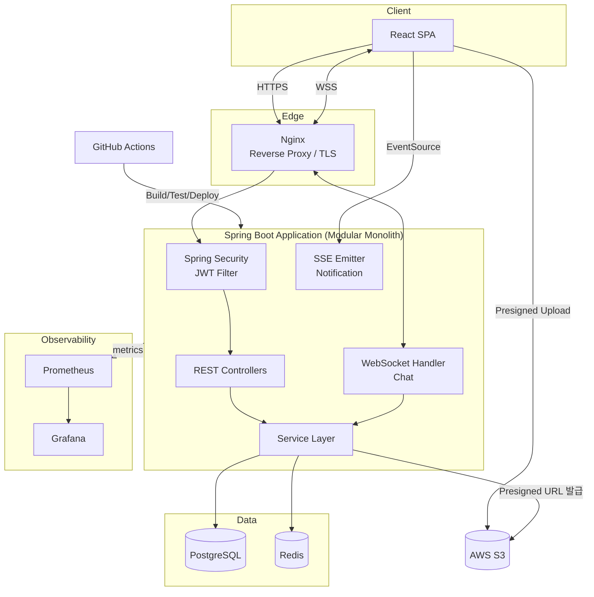
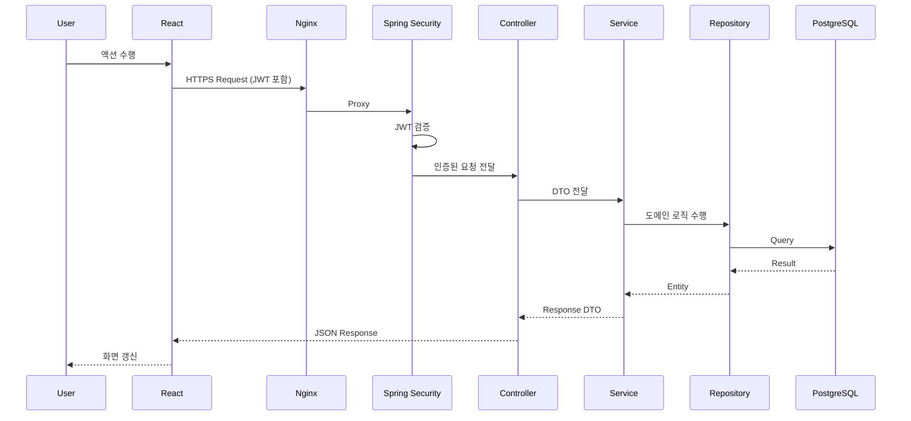
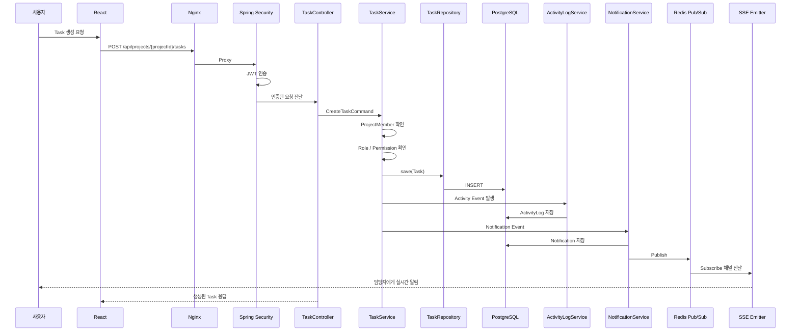
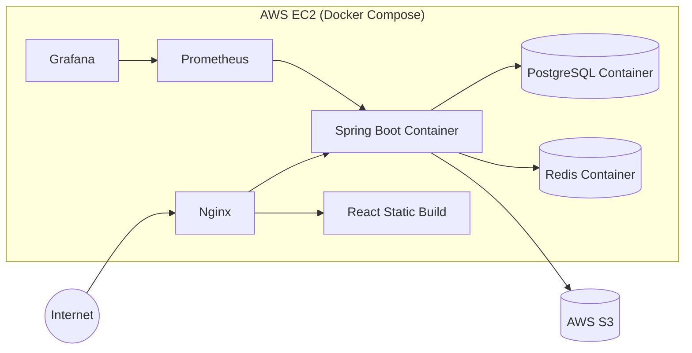

# 04. System Architecture

## 1. 전체 아키텍처

TeamFlow는 **Modular Monolith** 구조의 단일 Spring Boot Application을 중심으로, Frontend(React SPA), PostgreSQL, Redis, AWS S3, 그리고 Monitoring/CI 스택으로 구성된다. MSA/Kubernetes/Kafka 등은 현재 도입하지 않는다 ([20. 과도한 설계 방지](#설계-원칙) 참고).

## 2. 구성 요소 역할

| 구성 요소 | 역할 |
|---|---|
| React SPA | 사용자 UI, API 호출, SSE/WebSocket 클라이언트 |
| Nginx | TLS 종료, Reverse Proxy, 정적 파일 서빙, WebSocket Upgrade 처리 |
| Spring Security | JWT 검증, 인증/인가 필터 체인 |
| Controller | HTTP 요청/응답 처리, DTO 검증 |
| Service | 도메인 로직, 트랜잭션 경계 |
| Repository (Spring Data JPA) | PostgreSQL 접근 |
| Redis | Refresh Token, Cache, Pub/Sub, Rate Limiting |
| AWS S3 | 파일 저장소 (Presigned URL 업로드) |
| Prometheus / Grafana | 지표 수집 및 시각화 |
| GitHub Actions | CI/CD 파이프라인 |

각 계층의 상세 설계는 [05-backend-architecture.md](./05-backend-architecture.md), [06-frontend-architecture.md](./06-frontend-architecture.md)를 참고한다.

## 3. 기본 API Request Flow

부가 시스템(Redis, S3, Notification, ActivityLog, WebSocket, SSE)은 요청 성격에 따라 Service 계층에서 선택적으로 연동된다.

## 4. Task 생성 Flow

Task 생성은 REST API, 권한 검증, 영속화, 활동 기록, 실시간 알림이 모두 결합된 대표 시나리오이다.

## 5. 배포 아키텍처 (운영 환경)

상세 Infra 구성은 [13-infrastructure-design.md](./13-infrastructure-design.md)를 참고한다.

## 설계 원칙

- Backend는 Modular Monolith 단일 애플리케이션으로 시작한다. 향후 트래픽/조직 규모가 커질 경우 Auth/Project/Task/Notification/Chat 등을 개별 서비스로 분리할 수 있는 구조(Domain별 Package 분리, 명확한 Service 경계)를 유지한다 — 상태: Planned.
- Kubernetes, Kafka, Service Mesh, Event Sourcing, CQRS는 현재 규모(개인 포트폴리오, 단일 서버)에 과도한 복잡도를 유발하므로 도입하지 않는다.
