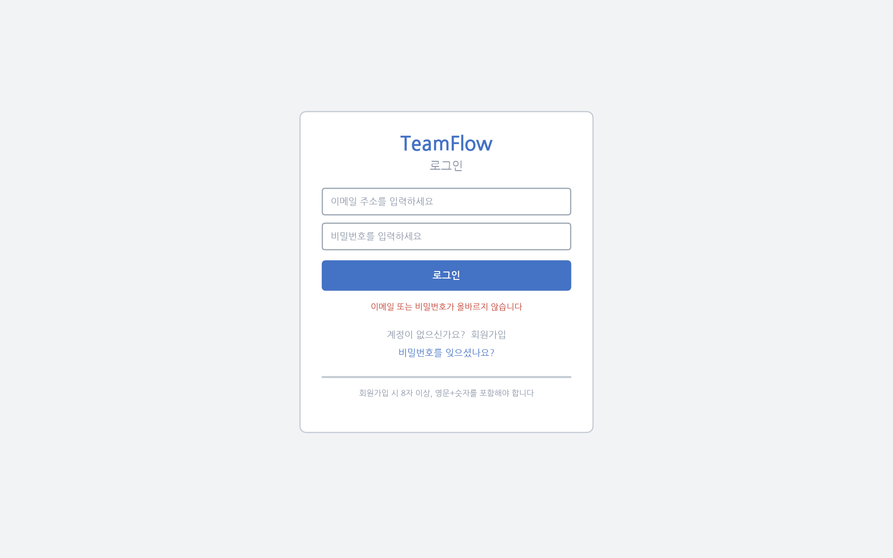
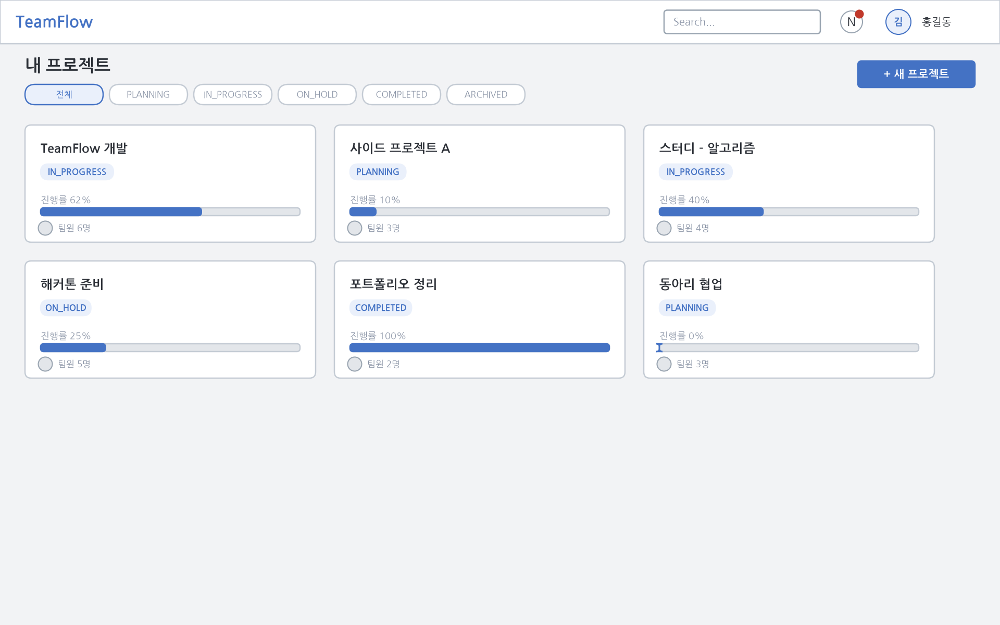
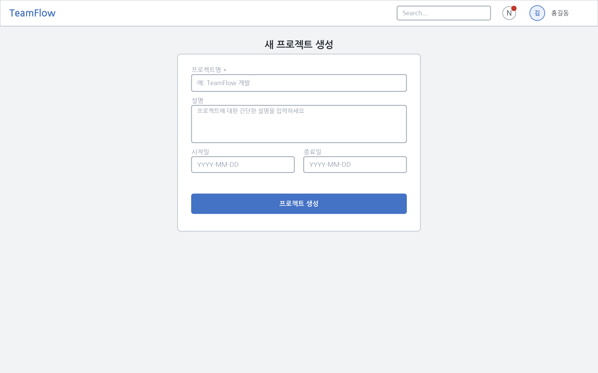
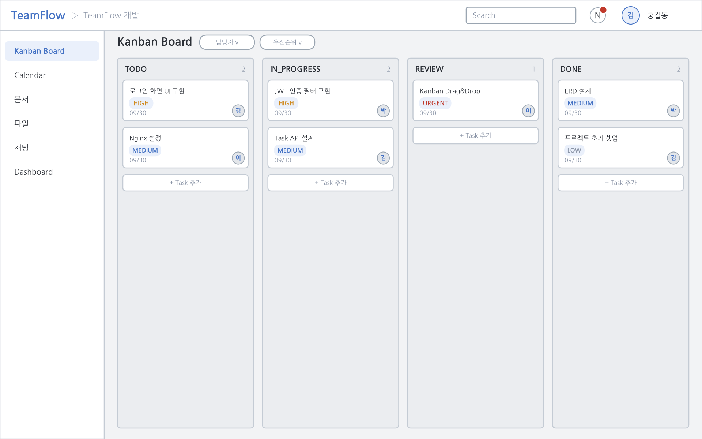
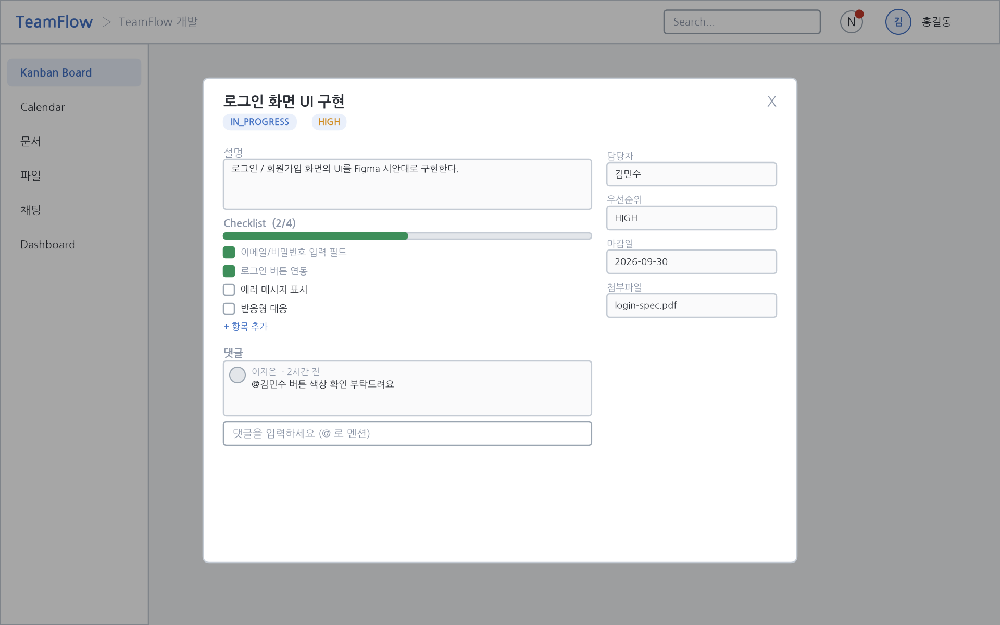
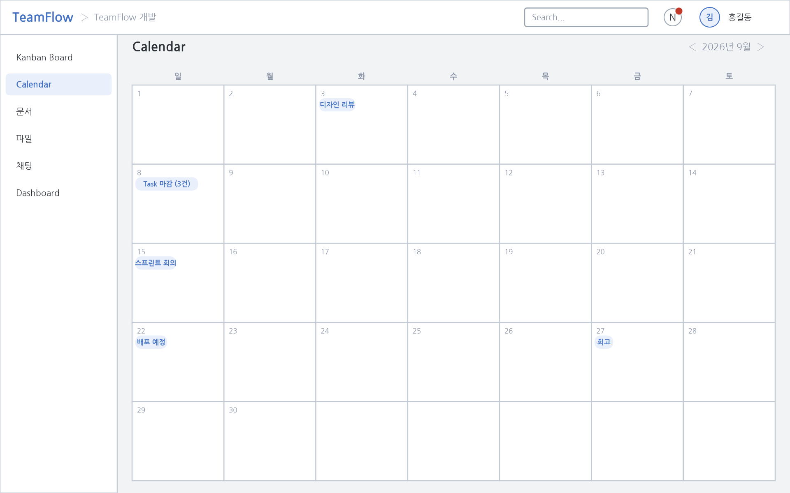
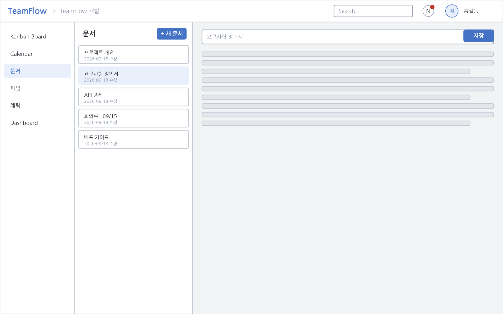
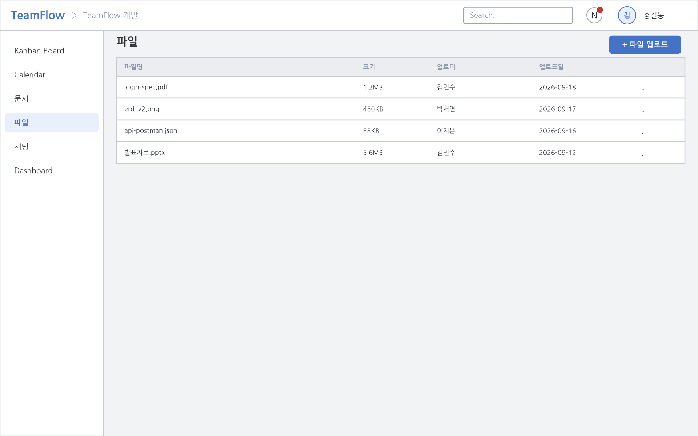
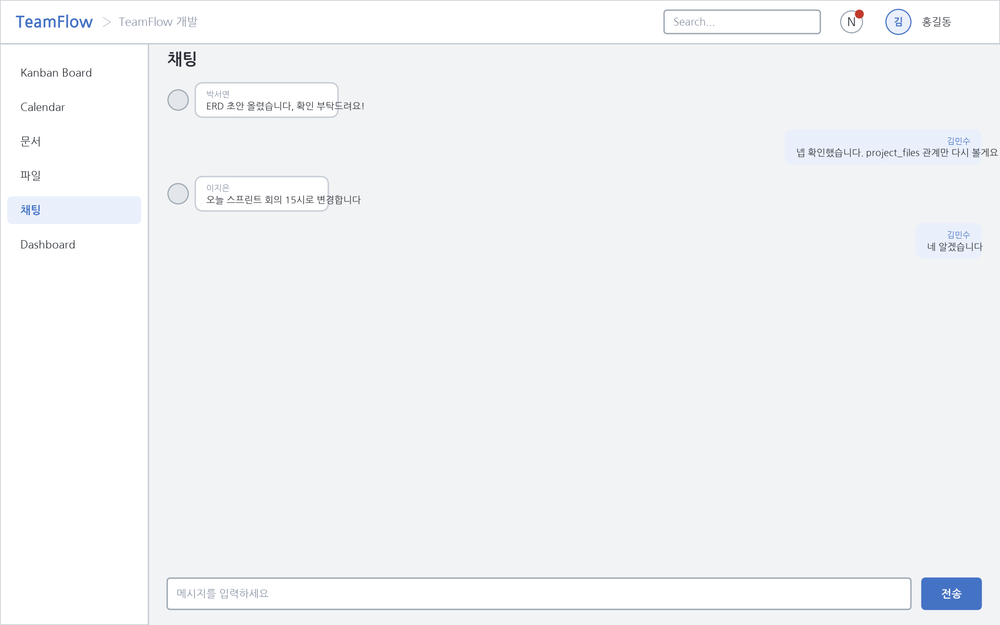
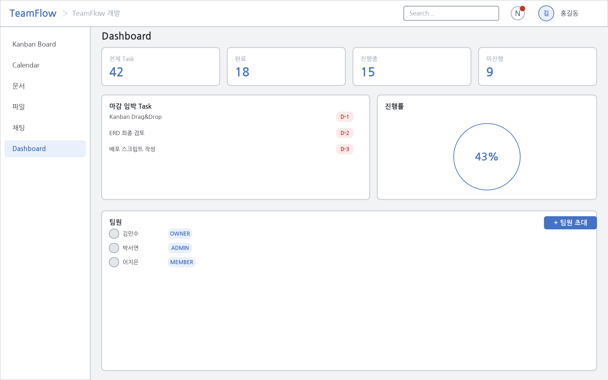

# 06. Frontend Architecture

## 1. 기술 스택

- React + TypeScript + Vite
- 서버 상태: React Query (`@tanstack/react-query`)
- 스타일: Tailwind CSS
- 클라이언트 상태(로그인 사용자, UI 상태): 경량 Store (Zustand 권장 — 신규 의존성 최소화를 위해 Context가 아닌 Zustand를 사용하는 이유는 리렌더링 최적화와 비동기 상태 분리가 쉽기 때문)

## 2. Directory 구조

Feature-Sliced Design을 단순화하여 적용한다. 계층 간 참조 규칙: `app → pages → features → entities → shared/components/hooks/services/utils/types`. 상위 계층은 하위 계층을 참조할 수 있으나 역방향 참조는 금지한다.

```
src/
├── app/                 앱 진입점, Router, Provider(QueryClient 등), 전역 레이아웃
├── pages/               라우트 단위 페이지 (URL과 1:1 대응)
│   ├── ProjectListPage/
│   ├── ProjectDetailPage/
│   ├── KanbanBoardPage/
│   └── ...
├── features/            사용자 행위 단위 기능 (예: task-create, task-status-change, invite-member)
│   └── task-create/
│       ├── ui/
│       ├── model/       (React Query mutation hook 등)
│       └── api/
├── entities/             도메인 모델 단위 (Task, Project, Notification 등)
│   └── task/
│       ├── ui/           TaskCard 등 도메인 표현 컴포넌트
│       ├── model/        타입, React Query query key/hook
│       └── api/          task API 함수
├── components/           재사용 UI 컴포넌트 (Button, Modal, Badge 등 도메인 비종속)
├── hooks/                범용 커스텀 훅 (useDebounce, useDisclosure 등)
├── services/             axios 인스턴스, API 공통 설정, SSE/WebSocket 클라이언트
├── store/                전역 클라이언트 상태 (인증 사용자, UI 토글)
├── utils/                순수 함수 유틸 (날짜 포맷 등)
└── types/                전역 공용 타입 (API 공통 응답 포맷 등)
```

## 3. Directory별 책임

| Directory | 책임 |
|---|---|
| app | Router 정의, QueryClientProvider/전역 Provider 구성, 전역 에러 바운더리 |
| pages | 라우트에 대응하는 화면 조립, features/entities 조합 |
| features | 사용자 액션(생성/수정/삭제/상태변경) 단위 기능. Mutation 로직과 관련 UI 포함 |
| entities | 도메인 데이터의 조회/표현 (TaskCard, ProjectSummary 등), Query 정의 |
| components | 도메인 비종속 재사용 컴포넌트 |
| hooks | 도메인 비종속 범용 훅 |
| services | HTTP client, SSE(EventSource) client, WebSocket client 초기화/공통 설정 |
| store | 로그인 사용자 정보, Access Token(메모리 보관), 전역 UI 상태 |
| utils | 순수 함수 |
| types | API 공통 응답 타입, 공통 Enum(TaskStatus 등) |

## 4. 서버 상태 관리: React Query

- 모든 API 호출은 `services/http.ts`의 axios 인스턴스를 통해 이루어진다.
- Query Key 규칙: `[domain, resourceId?, subResource?]` 예: `['tasks', projectId]`, `['task', taskId, 'comments']`
- Task 상태 변경(Kanban Drag & Drop)은 Optimistic Update를 적용하여 UI 반응성을 확보하고, 실패 시 롤백한다.
- Notification, Chat 등 실시간 데이터는 SSE/WebSocket 수신 시 React Query 캐시(`queryClient.setQueryData` / `invalidateQueries`)를 갱신하는 방식으로 일원화하여, 폴링 없이 서버 상태와 동기화한다.

## 5. 인증 토큰 처리

- Access Token은 메모리(Zustand store)에만 보관한다 (XSS 노출 최소화).
- Refresh Token은 HttpOnly Cookie로 관리한다 (Backend가 Set-Cookie로 발급).
- axios interceptor에서 401 응답 시 `/api/auth/refresh` 호출 후 원 요청 재시도, 재발급도 실패하면 로그아웃 처리.

## 6. 실시간 연결 관리 (services)

- `services/sse.ts`: 로그인 시 `EventSource`로 Notification 채널 연결, 로그아웃/언마운트 시 close.
- `services/websocket.ts`: 프로젝트 채팅 화면 진입 시 연결, 이탈 시 disconnect. 재연결 로직은 [10-realtime-architecture.md](./10-realtime-architecture.md) 참고.

## 7. 라우팅 구조 (예시)

```
/login
/signup
/projects
/projects/:projectId
/projects/:projectId/board       (Kanban)
/projects/:projectId/calendar
/projects/:projectId/documents
/projects/:projectId/files
/projects/:projectId/chat
/projects/:projectId/dashboard
/projects/:projectId/members
```

## 8. 화면 설계 (예시 레이아웃)

아래 10개는 위 라우팅 구조에 대응하는 대표 화면이다. 실제 구현 전 설계 단계이므로 화면 캡처 대신 저충실도 와이어프레임(예시 데이터)으로 레이아웃을 제시한다. 공통 셸(상단바: 로고·검색·알림·프로필, 좌측 사이드바: Board/Calendar/문서/파일/채팅/Dashboard)을 모든 프로젝트 하위 화면에 일관 적용한다. 각 화면의 UI 요소·API 연동 상세는 05-화면설계서(Hanium 서식 문서)를 참고한다 — 상태: Planned.

### SCR-001 로그인 / 회원가입 — `/login`, `/signup`



이메일/비밀번호 로그인 및 회원가입. 비로그인 상태에서만 접근 가능.

### SCR-002 프로젝트 목록 — `/projects`



참여 중인 프로젝트를 카드 그리드로 표시하고 상태별로 필터링한다.

### SCR-003 프로젝트 생성 — `/projects/new`



프로젝트명/설명/기간을 입력해 새 프로젝트를 생성한다.

### SCR-004 Kanban Board — `/projects/:projectId/board`



TODO/IN_PROGRESS/REVIEW/DONE 4개 컬럼에 Task 카드를 표시하고 Drag & Drop으로 상태를 변경한다.

### SCR-005 Task 상세 (모달) — `/projects/:projectId/board` (모달)



Task 제목/설명/담당자/우선순위/Checklist/댓글을 한 화면에서 확인·수정한다.

### SCR-006 Calendar — `/projects/:projectId/calendar`



월간 그리드에 Task 마감일을 표시한다.

### SCR-007 문서 — `/projects/:projectId/documents`



좌측 문서 목록, 우측 에디터의 2단 레이아웃으로 문서를 조회·작성한다.

### SCR-008 파일 — `/projects/:projectId/files`



파일명/크기/업로더/업로드일 테이블과 업로드 버튼을 제공한다.

### SCR-009 채팅 — `/projects/:projectId/chat`



말풍선 형태의 실시간 메시지 목록과 입력창을 제공한다.

### SCR-010 Dashboard / 팀원 관리 — `/projects/:projectId/dashboard`, `/projects/:projectId/members`



Task 통계 카드, 마감 임박 목록, 진행률, 팀원 목록/초대/Role 변경/소유권 위임을 제공한다(팀원 관리는 OWNER/ADMIN).
