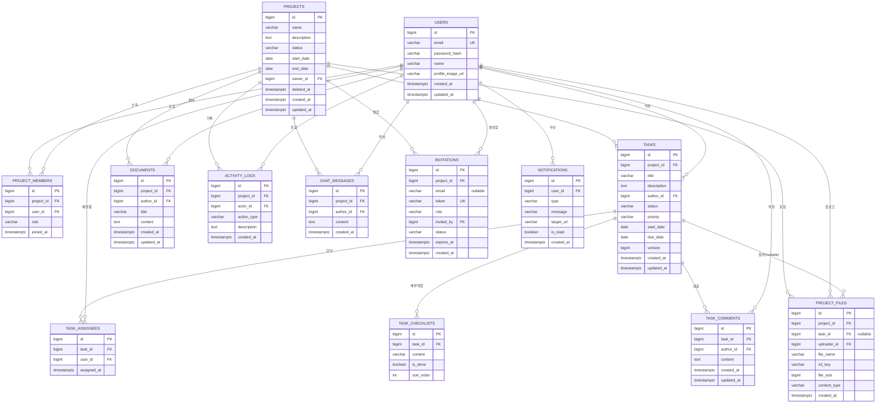

# 07. Database Design

DBMS: PostgreSQL. 모든 Table은 공통적으로 `created_at`, `updated_at`(TIMESTAMPTZ, 자동 관리)을 가진다. PK는 `BIGINT GENERATED ALWAYS AS IDENTITY`(또는 동등한 Sequence)를 사용한다.

## 1. ER Diagram

## 2. Table 정의

### users

| Column | Type | 제약 |
|---|---|---|
| id | bigint | PK |
| email | varchar(255) | UNIQUE, NOT NULL |
| password_hash | varchar(255) | NOT NULL |
| name | varchar(100) | NOT NULL |
| profile_image_url | varchar(500) | NULL |
| created_at / updated_at | timestamptz | NOT NULL |

Index: `idx_users_email` (UNIQUE, email)

### projects

| Column | Type | 제약 |
|---|---|---|
| id | bigint | PK |
| name | varchar(200) | NOT NULL |
| description | text | NULL |
| status | varchar(20) | NOT NULL, CHECK IN (PLANNING, IN_PROGRESS, ON_HOLD, COMPLETED, ARCHIVED) |
| start_date / end_date | date | NULL |
| owner_id | bigint | FK → users.id, NOT NULL |
| deleted_at | timestamptz | NULL |
| created_at / updated_at | timestamptz | NOT NULL |

Index: `idx_projects_owner` (owner_id)

Delete Policy: `status`(ARCHIVED)와 `deleted_at`은 서로 다른 개념이다. `status=ARCHIVED`는 사용자가 명시적으로 보관 처리한 상태로, 프로젝트는 여전히 존재하며 조회·읽기가 가능하다(쓰기는 제한, [02-requirements-specification.md](./02-requirements-specification.md) 참고). 반면 `deleted_at IS NOT NULL`은 `DELETE /api/projects/{projectId}` 호출로 인한 삭제로, 모든 일반 조회 쿼리는 `deleted_at IS NULL`을 기본 조건으로 포함해 결과에서 제외한다. 하위 Task/Document/File/Chat/ActivityLog/Invitation은 물리적으로 함께 지우지 않고 Project와 함께 숨김 처리되며, 보관 기간(예: 30일) 경과 후 배치로 물리 삭제한다 — 상태: Optional(배치 삭제 미구현 시 무기한 보관).

### invitations

| Column | Type | 제약 |
|---|---|---|
| id | bigint | PK |
| project_id | bigint | FK → projects.id, NOT NULL, ON DELETE CASCADE |
| email | varchar(255) | NULL (초대 링크 방식일 경우 NULL) |
| token | varchar(100) | NOT NULL, UNIQUE |
| role | varchar(20) | NOT NULL, CHECK IN (ADMIN, MEMBER, GUEST), DEFAULT 'MEMBER' — 수락 시 부여할 Role |
| invited_by | bigint | FK → users.id, NOT NULL |
| status | varchar(20) | NOT NULL, CHECK IN (PENDING, ACCEPTED, EXPIRED, REVOKED), DEFAULT 'PENDING' |
| expires_at | timestamptz | NOT NULL |
| created_at | timestamptz | NOT NULL |

Index: `uq_invitations_token` UNIQUE(token), `idx_invitations_project_status` (project_id, status)

### project_members

| Column | Type | 제약 |
|---|---|---|
| id | bigint | PK |
| project_id | bigint | FK → projects.id, NOT NULL, ON DELETE CASCADE |
| user_id | bigint | FK → users.id, NOT NULL, ON DELETE CASCADE |
| role | varchar(20) | NOT NULL, CHECK IN (OWNER, ADMIN, MEMBER, GUEST) |
| joined_at | timestamptz | NOT NULL |

Index: `uq_project_members_project_user` UNIQUE(project_id, user_id)

### tasks

| Column | Type | 제약 |
|---|---|---|
| id | bigint | PK |
| project_id | bigint | FK → projects.id, NOT NULL, ON DELETE CASCADE |
| title | varchar(255) | NOT NULL |
| description | text | NULL |
| author_id | bigint | FK → users.id, NOT NULL |
| status | varchar(20) | NOT NULL, CHECK IN (TODO, IN_PROGRESS, REVIEW, DONE), DEFAULT 'TODO' |
| priority | varchar(20) | NOT NULL, CHECK IN (LOW, MEDIUM, HIGH, URGENT), DEFAULT 'MEDIUM' |
| start_date / due_date | date | NULL |
| version | bigint | NOT NULL, DEFAULT 0 |
| created_at / updated_at | timestamptz | NOT NULL |

Index: `idx_tasks_project_status` (project_id, status) — Kanban Board 조회 최적화, `idx_tasks_due_date` (due_date) — 마감임박 조회 최적화

`version`은 JPA `@Version` 기반 낙관적 락(Optimistic Locking)에 사용한다. 동일 Task를 두 사용자가 동시에 수정하면 먼저 커밋된 요청만 성공하고 나중 요청은 `OptimisticLockingFailureException` → `TASK_VERSION_CONFLICT`(409)로 응답한다([08-api-specification.md](./08-api-specification.md) 4장, [README.md](../README.md) Technical Challenges #1 참고).

### task_assignees

| Column | Type | 제약 |
|---|---|---|
| id | bigint | PK |
| task_id | bigint | FK → tasks.id, NOT NULL, ON DELETE CASCADE |
| user_id | bigint | FK → users.id, NOT NULL |
| assigned_at | timestamptz | NOT NULL |

Index: `uq_task_assignees_task_user` UNIQUE(task_id, user_id)

### task_checklists

| Column | Type | 제약 |
|---|---|---|
| id | bigint | PK |
| task_id | bigint | FK → tasks.id, NOT NULL, ON DELETE CASCADE |
| content | varchar(500) | NOT NULL |
| is_done | boolean | NOT NULL, DEFAULT false |
| sort_order | int | NOT NULL, DEFAULT 0 |

### task_comments

| Column | Type | 제약 |
|---|---|---|
| id | bigint | PK |
| task_id | bigint | FK → tasks.id, NOT NULL, ON DELETE CASCADE |
| author_id | bigint | FK → users.id, NOT NULL |
| content | text | NOT NULL |
| created_at / updated_at | timestamptz | NOT NULL |

Index: `idx_task_comments_task` (task_id)

### notifications

| Column | Type | 제약 |
|---|---|---|
| id | bigint | PK |
| user_id | bigint | FK → users.id, NOT NULL, ON DELETE CASCADE |
| type | varchar(30) | NOT NULL (TASK_ASSIGNED, TASK_STATUS_CHANGED, MENTION, PROJECT_INVITE, COMMENT_ADDED, DUE_SOON, ANNOUNCEMENT) |
| message | varchar(500) | NOT NULL |
| target_url | varchar(500) | NULL |
| is_read | boolean | NOT NULL, DEFAULT false |
| created_at | timestamptz | NOT NULL |

Index: `idx_notifications_user_read` (user_id, is_read, created_at DESC)

### chat_messages

| Column | Type | 제약 |
|---|---|---|
| id | bigint | PK |
| project_id | bigint | FK → projects.id, NOT NULL, ON DELETE CASCADE |
| author_id | bigint | FK → users.id, NOT NULL |
| content | text | NOT NULL |
| created_at | timestamptz | NOT NULL |

Index: `idx_chat_messages_project_created` (project_id, created_at DESC)

### documents

| Column | Type | 제약 |
|---|---|---|
| id | bigint | PK |
| project_id | bigint | FK → projects.id, NOT NULL, ON DELETE CASCADE |
| author_id | bigint | FK → users.id, NOT NULL |
| title | varchar(255) | NOT NULL |
| content | text | NULL |
| created_at / updated_at | timestamptz | NOT NULL |

### project_files

| Column | Type | 제약 |
|---|---|---|
| id | bigint | PK |
| project_id | bigint | FK → projects.id, NOT NULL, ON DELETE CASCADE |
| task_id | bigint | FK → tasks.id, NULL, ON DELETE SET NULL |
| uploader_id | bigint | FK → users.id, NOT NULL |
| file_name | varchar(255) | NOT NULL |
| s3_key | varchar(500) | NOT NULL, UNIQUE |
| file_size | bigint | NOT NULL |
| content_type | varchar(100) | NOT NULL |
| created_at | timestamptz | NOT NULL |

### activity_logs

| Column | Type | 제약 |
|---|---|---|
| id | bigint | PK |
| project_id | bigint | FK → projects.id, NOT NULL, ON DELETE CASCADE |
| actor_id | bigint | FK → users.id, NOT NULL |
| action_type | varchar(50) | NOT NULL (TASK_CREATED, TASK_STATUS_CHANGED, MEMBER_INVITED, MEMBER_ROLE_CHANGED 등) |
| description | text | NOT NULL |
| created_at | timestamptz | NOT NULL |

Index: `idx_activity_logs_project_created` (project_id, created_at DESC)

## 3. Timestamp 정책

- 모든 Entity는 `created_at`을 삽입 시 자동 설정하고 이후 변경하지 않는다.
- 변경 가능한 Entity는 `updated_at`을 JPA Auditing(`@EntityListeners(AuditingEntityListener.class)`)으로 자동 갱신한다.
- 시간대는 UTC로 저장하고, Frontend에서 사용자 로컬 타임존으로 변환하여 표시한다.

## 4. Delete Policy 정리

| Entity | 정책 |
|---|---|
| Project | Soft Delete(`deleted_at` 설정) — OWNER만 가능, 하위 데이터는 함께 숨김 처리 후 보관 기간 경과 시 배치로 물리 삭제(상태: Optional). `status=ARCHIVED`는 별개의 사용자 보관 상태이며 삭제가 아니다 |
| Invitation | Hard Delete 하지 않음 — 취소는 `status=REVOKED`로 전환, 만료는 `status=EXPIRED`로 전환(배치 또는 조회 시점 판정) |
| Task | Hard Delete + CASCADE(Assignee/Checklist/Comment). 수정/상태변경은 `version` 컬럼으로 동시 수정 충돌을 검증 |
| ProjectMember | Hard Delete (탈퇴/제거 시) |
| Notification | Hard Delete (읽음 처리와 별개로 보관 기간 경과 시 배치 삭제, 상태: Optional) |
| ActivityLog | Hard Delete 하지 않음 (감사 목적, 보관) |
