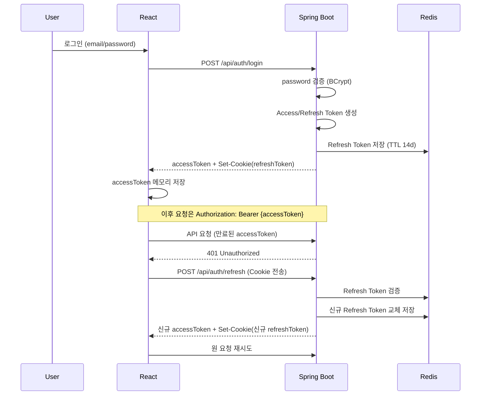
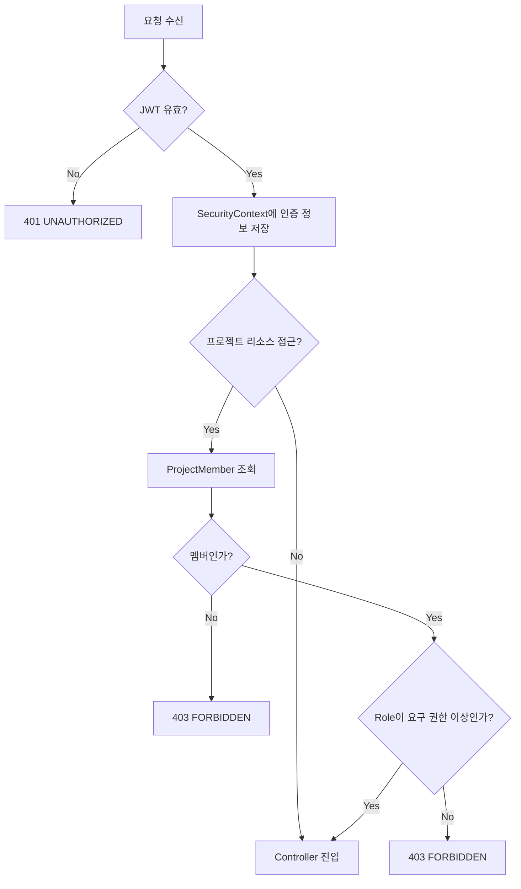

# 09. Authentication & Authorization

## 1. Spring Security 구성 개요

- `SecurityFilterChain`에 Custom `JwtAuthenticationFilter`를 `UsernamePasswordAuthenticationFilter` 이전에 등록한다.
- 인증 방식은 Stateless(Session 미사용, `SessionCreationPolicy.STATELESS`).
- 인증 성공 시 `SecurityContext`에 `UserPrincipal`(userId, email, role 등)을 저장한다.
- CORS는 허용 Origin(Frontend 도메인)만 화이트리스트로 등록한다.

## 2. JWT 구조

| 항목 | Access Token | Refresh Token |
|---|---|---|
| 만료 시간 | 30분 | 14일 |
| 저장 위치(서버) | 저장하지 않음(Stateless) | Redis (`refresh:{userId}` 키) |
| 저장 위치(클라이언트) | 메모리 | HttpOnly Cookie |
| Claim | sub(userId), email, iat, exp | sub(userId), iat, exp, jti |

- Access Token은 서명(HS256 또는 RS256)만 검증하고 별도 저장소를 조회하지 않아 검증 비용이 낮다.
- Refresh Token은 Redis에 저장된 값과 일치할 때만 유효하며, 로그아웃/재발급 시 즉시 무효화(삭제 또는 교체)할 수 있다.

## 3. Token Rotation

Refresh Token 재사용 공격을 방지하기 위해 **Refresh Token Rotation**을 적용한다.

1. `/api/auth/refresh` 호출 시 기존 Refresh Token의 유효성을 Redis에서 확인
2. 유효하면 신규 Access Token + 신규 Refresh Token 발급, Redis 값을 신규 토큰으로 교체(기존 토큰 폐기)
3. 이미 폐기된(교체된) Refresh Token으로 재요청이 들어오면 탈취 의심으로 판단하여 해당 사용자의 모든 세션을 무효화 — 상태: Optional(초기 버전은 단순 교체만 적용)

## 4. Authentication Flow

## 5. Authorization Flow (RBAC + Project Permission)

## 6. RBAC Role 정의

| Role | 설명 |
|---|---|
| OWNER | 프로젝트 생성자. 프로젝트 삭제/설정/관리자 지정/팀원 관리/권한 관리 및 모든 기능 접근 |
| ADMIN | 팀원 관리, Task/일정/문서 관리, 프로젝트 운영 |
| MEMBER | Task 생성/수정, 자신의 Task 관리, 댓글 작성, 문서 작성, 파일 업로드 |
| GUEST | 허용된 데이터 조회, 일부 댓글 작성, 제한된 기능 사용 |

## 7. 권한 매트릭스

| 기능 | OWNER | ADMIN | MEMBER | GUEST |
|---|---|---|---|---|
| 프로젝트 수정 | O | O | X | X |
| 프로젝트 삭제 | O | X | X | X |
| 팀원 초대/제거 | O | O | X | X |
| 팀원 Role 변경 | O | X | X | X |
| Task 생성 | O | O | O | X |
| Task 수정(본인 작성/담당) | O | O | O | X |
| Task 삭제 | O | O | 본인 작성 Task만 | X |
| 댓글 작성 | O | O | O | 제한적 허용 |
| 문서 작성/수정 | O | O | O | X |
| 파일 업로드 | O | O | O | X |
| 데이터 조회 | O | O | O | O(허용 범위) |

## 8. 구현 방식

- Controller: `@PreAuthorize("isAuthenticated()")`로 로그인 여부만 1차 검증
- Service: `member` Module의 `ProjectPermissionChecker.require(projectId, userId, RoleAtLeast.ADMIN)` 형태로 프로젝트 단위 Role 검증 ([05-backend-architecture.md](./05-backend-architecture.md) 6절 참고)
- Role은 Enum으로 정의하고 `OWNER > ADMIN > MEMBER > GUEST` 순서의 등급 비교(`ordinal` 또는 명시적 weight)로 "이상 권한" 검증을 단순화한다.

## 9. Logout

- `/api/auth/logout` 호출 시 Redis에서 해당 사용자의 Refresh Token 키 삭제
- Access Token은 만료 시간이 짧아(30분) 별도 블랙리스트 없이 자연 만료로 처리 — 상태: Core (즉시 무효화가 필요한 보안 요구사항 발생 시 블랙리스트 도입, 상태: Optional)
