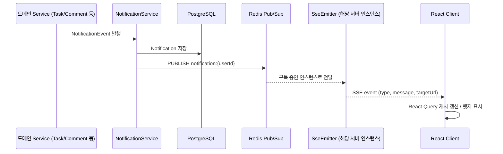
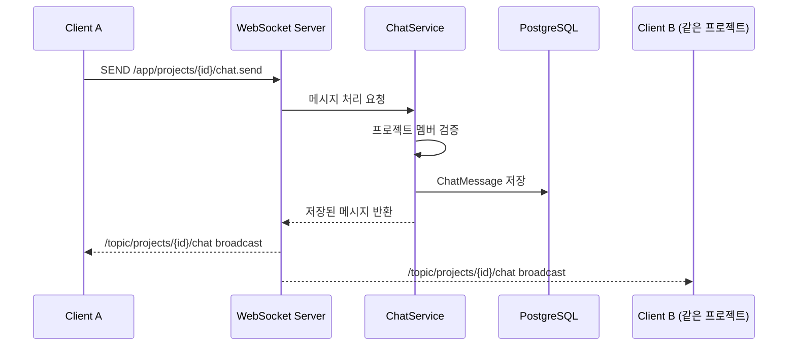

# 10. Realtime Architecture

TeamFlow는 목적에 따라 두 가지 실시간 기술을 분리하여 사용한다.

| 기술 | 용도 | 방향 |
|---|---|---|
| SSE (Server-Sent Events) | Notification (알림) | 단방향 (서버 → 클라이언트) |
| WebSocket (STOMP) | Chat (채팅) | 양방향 |

알림은 서버가 이벤트를 감지해 클라이언트에 전달하기만 하면 되는 단방향 특성이라 SSE가 적합하고(HTTP 기반이라 인프라 부담이 적음), 채팅은 클라이언트 간 실시간 양방향 송수신이 필요하므로 WebSocket을 사용한다.

## 1. SSE (Notification)

### 1.1 Connection

- Client는 로그인 직후 `GET /api/notifications/subscribe`로 `EventSource` 연결을 수립한다.
- 인증은 Access Token을 Query Parameter(`?token=`)로 전달한다 (`EventSource`는 커스텀 헤더를 지원하지 않으므로).
- 서버는 사용자별 `SseEmitter`를 관리하며(`userId → List<SseEmitter>`, 다중 탭 지원), 유휴 연결 유지를 위해 주기적으로 heartbeat(`comment` 이벤트)를 전송한다.

### 1.2 Message Flow

- 단일 서버 인스턴스 환경에서는 Redis Pub/Sub 없이 메모리 내 `SseEmitter` 직접 전송으로도 충분하지만, 서버가 여러 인스턴스로 확장될 경우를 대비해 Redis Pub/Sub을 이벤트 브로드캐스트 계층으로 둔다 — 상태: Core(단일 인스턴스에서도 동일 코드 경로 사용), 확장 시나리오는 상태: Planned.

### 1.3 Reconnection

- `EventSource`는 브라우저가 자동으로 재연결을 시도한다(기본 3초 간격, 서버가 `retry:` 필드로 조정 가능).
- 재연결 시 클라이언트는 `GET /api/notifications?isRead=false`로 유실 가능성이 있는 알림을 REST로 보완 조회한다.

### 1.4 Error Handling

- 인증 실패 시 401로 연결 거부, 클라이언트는 재연결하지 않고 로그인 페이지로 이동.
- 서버 재시작 등으로 연결이 끊기면 클라이언트 자동 재연결 + REST 보완 조회로 정합성을 확보한다.

## 2. WebSocket (Chat)

### 2.1 Connection

- STOMP over WebSocket, endpoint: `/ws/chat` (Nginx에서 `Upgrade: websocket` 헤더 프록시 설정 필요)
- 인증은 STOMP `CONNECT` 프레임의 `Authorization` 헤더로 Access Token 전달, 서버의 `ChannelInterceptor`에서 검증
- 채널 구독: `/topic/projects/{projectId}/chat` (프로젝트 멤버만 구독 가능하도록 구독 시점에 권한 검증)
- 메시지 발행: `/app/projects/{projectId}/chat.send`

### 2.2 Message Flow

### 2.3 Reconnection

- 클라이언트는 연결 끊김 감지 시 지수 백오프(1s, 2s, 4s ... 최대 30s)로 재연결을 시도한다.
- 재연결 후 마지막으로 수신한 메시지 이후 이력을 `GET /api/projects/{projectId}/chat/messages?before=` 커서 기반으로 보완 조회한다.

### 2.4 Error Handling

- 프로젝트 비멤버의 구독/발행 시도는 서버에서 거부(`ERROR` 프레임) 후 연결 종료.
- 메시지 저장 실패 시 발신 클라이언트에게만 에러 프레임을 전송하고 broadcast하지 않는다.

## 3. Redis Pub/Sub 확장 가능성

- 현재 단일 서버 인스턴스 기준으로는 SSE/WebSocket 모두 In-Memory 세션 관리로 충분하다.
- 서버가 다중 인스턴스로 확장되면 WebSocket도 STOMP 브로커를 Redis(또는 RabbitMQ) 기반 외부 브로커로 교체하여 인스턴스 간 메시지 전달을 보장해야 한다 — 상태: Planned.
- Notification은 이미 Redis Pub/Sub 구조를 갖추고 있어 확장 시 추가 설계 비용이 낮다.
