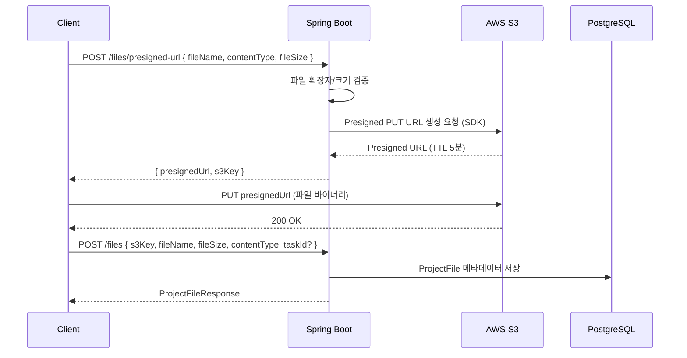

# 11. File Storage Design

## 1. 설계 원칙

- Backend는 파일 바이너리를 직접 다루지 않는다 (Local Storage 저장 금지).
- 모든 파일은 AWS S3에 저장하고, Client가 Presigned URL을 통해 S3에 직접 업로드한다.
- Backend는 업로드 URL 발급과 메타데이터 관리만 담당하여 서버 부하(대용량 파일 처리)를 제거한다.

## 2. Upload Flow



## 3. S3 Key Naming Convention

```
projects/{projectId}/{yyyy}/{MM}/{uuid}_{fileName}
```

- `uuid`를 포함하여 동일 파일명 충돌을 방지한다.
- Task 첨부파일도 동일 규칙을 사용하며 `project_files.task_id`로 연관관계만 구분한다 (별도 경로 분리 없음).

## 4. 업로드 제약

| 항목 | 정책 |
|---|---|
| 최대 파일 크기 | 50MB (Optional로 상향 조정 가능) |
| 허용 확장자 | 이미지(jpg, png, gif, webp), 문서(pdf, doc, docx, xls, xlsx, ppt, pptx), 압축(zip), 텍스트(txt, md) |
| Presigned URL TTL | 업로드용 5분, 다운로드(GET)용 10분 |
| Content-Type 검증 | Presigned URL 발급 시 지정한 Content-Type과 실제 업로드 Content-Type 일치 강제(S3 정책 조건부 서명) |

## 5. 다운로드

- 파일 다운로드도 Presigned GET URL을 발급하여 제공한다 (Private Bucket 유지, S3 객체 직접 공개 금지).
- `GET /api/projects/{projectId}/files/{fileId}/download-url` → `{ presignedUrl }` 응답 — 상태: Core

## 6. 삭제

- 파일 삭제 시 S3 객체 삭제와 `project_files` 레코드 삭제를 하나의 Service 트랜잭션에서 처리한다.
- S3 삭제가 실패해도 메타데이터는 삭제 처리하고, S3 잔여 객체는 별도 배치로 정리한다 — 상태: Optional(수동 정리로 시작, 자동 배치는 확장 옵션).

## 7. Profile / Project Image

- 프로필 이미지, 프로젝트 대표 이미지도 동일한 Presigned URL 방식을 사용하되, `users.profile_image_url` / `projects` 관련 필드에 최종 S3 URL(또는 key)만 저장한다.
