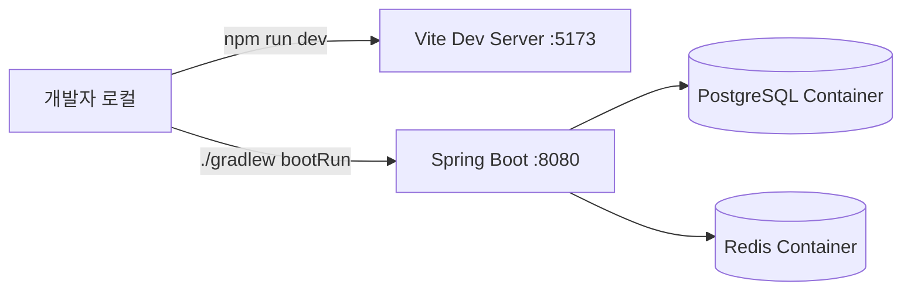
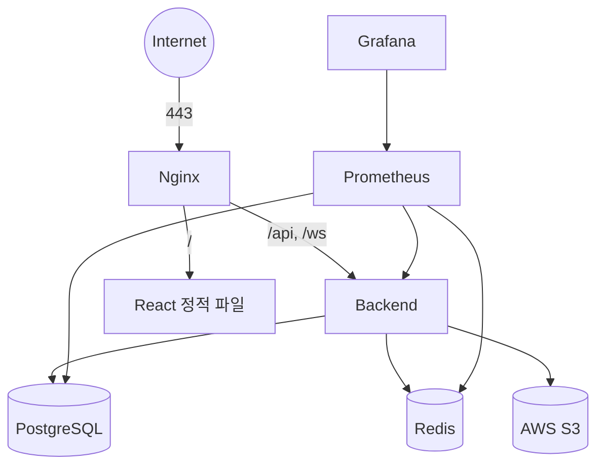

# 13. Infrastructure Design

## 1. 컨테이너 구성

Docker Compose로 아래 서비스를 단일 EC2(또는 동급 Cloud Server) 인스턴스에서 운영한다.

| 서비스 | 이미지/베이스 | 역할 |
|---|---|---|
| nginx | nginx:alpine | Reverse Proxy, TLS 종료, 정적 파일 서빙 |
| backend | Spring Boot (Multi-stage Docker Build) | API 서버 |
| frontend | React 정적 빌드 (Nginx가 서빙, 별도 컨테이너 없이 backend와 통합 배포도 가능) |
| postgres | postgres:16-alpine | 주 데이터베이스 |
| redis | redis:7-alpine | 캐시/토큰/Pub-Sub |
| prometheus | prom/prometheus | 지표 수집 |
| grafana | grafana/grafana | 대시보드 |

## 2. 개발 환경 (docker-compose.dev.yml)



- Frontend/Backend는 로컬에서 직접 실행(Hot Reload), PostgreSQL/Redis만 Docker Compose로 띄운다.
- 환경변수는 `.env.local`(Git 미포함)로 관리한다.

```yaml
# docker-compose.dev.yml (요지)
services:
  postgres:
    image: postgres:16-alpine
    ports: ["5432:5432"]
    environment:
      POSTGRES_DB: teamflow
      POSTGRES_USER: teamflow
      POSTGRES_PASSWORD: ${DB_PASSWORD}
  redis:
    image: redis:7-alpine
    ports: ["6379:6379"]
```

## 3. 운영 환경 (docker-compose.prod.yml)



- 모든 컨테이너는 하나의 Docker Compose 파일로 정의하고 내부 네트워크(bridge)로 통신, 외부 노출은 Nginx(443)만 허용한다.
- PostgreSQL/Redis 데이터는 Named Volume으로 영속화한다.
- 환경변수(DB 비밀번호, JWT Secret, AWS 자격증명)는 `.env`(Git 미포함) + GitHub Actions Secrets로 관리한다.

## 4. Nginx 설정 요지

```nginx
server {
    listen 443 ssl;
    server_name teamflow.example.com;

    location /api/ {
        proxy_pass http://backend:8080;
        proxy_set_header Authorization $http_authorization;
    }

    location /ws/ {
        proxy_pass http://backend:8080;
        proxy_http_version 1.1;
        proxy_set_header Upgrade $http_upgrade;
        proxy_set_header Connection "upgrade";
    }

    location / {
        root /usr/share/nginx/html;
        try_files $uri /index.html;
    }
}
```

## 5. 리소스 규모 (개인 포트폴리오 기준)

| 리소스 | 사양 |
|---|---|
| EC2 인스턴스 | t3.small (2 vCPU, 2GB RAM) 수준 |
| PostgreSQL | 단일 인스턴스, 별도 Replica 없음 |
| Redis | 단일 인스턴스, Persistence(AOF) 활성화 |

Kubernetes, Multi-AZ, Auto Scaling은 현재 규모에서 과도하므로 도입하지 않는다 ([04-system-architecture.md](./04-system-architecture.md) 설계 원칙 참고).
