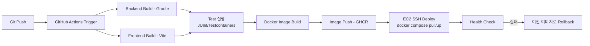

# 14. CI/CD Design

## 1. Pipeline 개요

## 2. Workflow 구성

### 2.1 `ci.yml` (PR / main 브랜치 Push 시 실행)

- Backend: `./gradlew build test` (Testcontainers로 실제 PostgreSQL/Redis 컨테이너 사용)
- Frontend: `npm ci && npm run build && npm run test`
- Lint: ESLint(Frontend), Checkstyle/Spotless(Backend) — 상태: Optional

### 2.2 `deploy.yml` (main 브랜치 merge 시 실행)

1. `ci.yml` 통과 확인
2. Backend/Frontend Docker 이미지 빌드 및 GitHub Container Registry(GHCR) 푸시 (태그: `git sha`)
3. `appleboy/ssh-action`으로 EC2에 SSH 접속하여:
   - `docker compose pull`
   - `docker compose up -d`
4. 배포 후 `GET /actuator/health` 호출로 Health Check
5. Health Check 실패 시 직전 태그 이미지로 재기동(Rollback)

## 3. Branch 전략

- `main`: 배포 브랜치. 항상 배포 가능한 상태 유지.
- `develop`: 통합 브랜치 (Optional, 개인 프로젝트 규모에서는 생략 가능).
- `feature/{domain}-{설명}`: 기능 브랜치. PR을 통해 `main`(또는 `develop`)으로 병합.
- PR 병합 조건: CI(Build + Test) 통과 필수.

## 4. Secrets 관리

GitHub Actions Secrets에 다음 값을 등록한다: `DB_PASSWORD`, `JWT_SECRET`, `AWS_ACCESS_KEY_ID`, `AWS_SECRET_ACCESS_KEY`, `EC2_SSH_KEY`, `EC2_HOST`. Repository 코드에는 평문 비밀값을 포함하지 않는다.

## 5. Health Check 기준

- Spring Boot Actuator `/actuator/health` 엔드포인트가 `{ "status": "UP" }`을 반환해야 배포 성공으로 간주한다.
- DB/Redis 연결 상태도 Health Indicator에 포함하여 의존성 장애를 조기에 감지한다.
