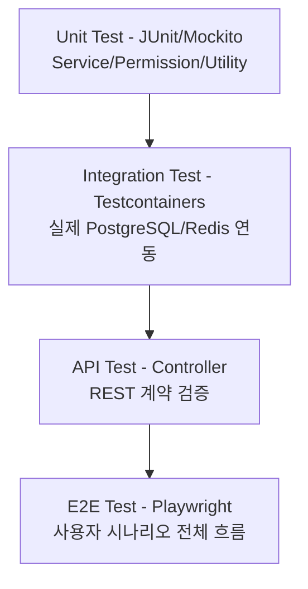
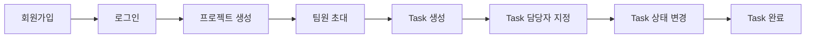

# 15. Test Strategy

## 1. Test Layer 개요

테스트 피라미드 원칙에 따라 Unit Test가 가장 많고, E2E로 갈수록 수를 줄여 실행 비용과 유지보수 비용을 관리한다.

## 2. Unit Test (JUnit + Mockito)

- **대상**: Service 로직, 권한 검증 로직(`ProjectPermissionChecker`), Utility(날짜 계산, Mention 파서 등)
- **검증 내용**: Repository/외부 의존성을 Mock으로 대체하고 순수 비즈니스 로직의 분기/예외를 검증한다.
- **예시**: "GUEST가 Task 생성을 시도하면 `ForbiddenException`이 발생한다", "Task 상태를 DONE → TODO로 되돌릴 때 ActivityLog 메시지가 올바르게 생성된다"

## 3. Integration Test (JUnit + Testcontainers)

- **대상**: Repository, Service + Repository 조합
- **검증 내용**: 실제 PostgreSQL/Redis 컨테이너를 띄워 Query, 트랜잭션, Cache Eviction이 실제 환경과 동일하게 동작하는지 검증한다. (H2 등 In-Memory DB 대체 금지 — PostgreSQL 전용 기능(예: 인덱스, CHECK 제약)의 동작 차이를 방지)
- **예시**: "ProjectMember UNIQUE 제약으로 중복 초대 수락 시 예외가 발생한다", "Task 상태 변경 후 `cache:dashboard:{projectId}` 키가 삭제된다"

## 4. API Test (Controller)

- **대상**: `@SpringBootTest` + `MockMvc` 또는 `WebTestClient`
- **검증 내용**: HTTP Status, Response Body 스키마, 인증/인가 필터 동작, 공통 예외 응답 포맷이 [08-api-specification.md](./08-api-specification.md), [18-error-handling-policy.md](./18-error-handling-policy.md)와 일치하는지 검증한다.
- **예시**: "인증 없이 `POST /api/projects` 호출 시 401을 반환한다", "존재하지 않는 Task 조회 시 `TASK_NOT_FOUND` 코드를 반환한다"

## 5. E2E Test (Playwright)

- **대상**: 실제 브라우저에서 Frontend + Backend 통합 시나리오
- **핵심 시나리오**:

- 위 시나리오를 Playwright로 자동화하여 CI에서 회귀를 방지한다.
- 실시간 기능(SSE/WebSocket)은 별도 시나리오로 "Task 배정 시 담당자 화면에 알림이 표시된다"를 검증한다.

## 6. Security Test

- 인증 없는 API 접근, 타 프로젝트 리소스 접근(수평 권한 상승), Role 미만 사용자의 상위 기능 접근 시도를 API Test 레벨에서 케이스로 포함한다.
- SQL Injection/XSS는 [17-security-design.md](./17-security-design.md)의 대응 방식(JPA Parameter Binding, Frontend Sanitization)에 대한 회귀 테스트로 다룬다.

## 7. Performance Test (상태: Optional)

- 도구: k6 또는 JMeter
- 대상: Task 목록 조회, Dashboard 조회 등 트래픽이 집중될 API
- 목표: [02-requirements-specification.md](./02-requirements-specification.md)의 NFR-PERFORMANCE-001(P95 300ms) 달성 여부 확인

## 8. CI 연동

- Unit/Integration/API Test는 `ci.yml`에서 매 PR마다 실행한다 ([14-ci-cd-design.md](./14-ci-cd-design.md) 참고).
- E2E Test는 실행 시간이 길어 `main` 브랜치 merge 후 또는 별도 스케줄(nightly)로 실행한다 — 상태: Optional.
