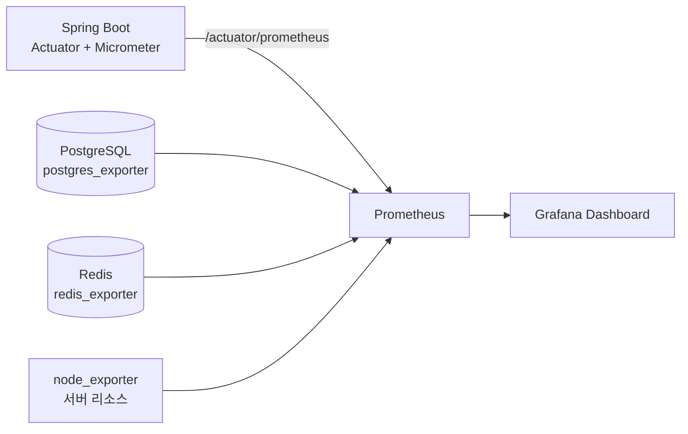

# 16. Monitoring Design

## 1. 구성

- Spring Boot는 `spring-boot-starter-actuator` + `micrometer-registry-prometheus`로 `/actuator/prometheus` 엔드포인트를 노출한다.
- PostgreSQL/Redis는 각각 `postgres_exporter`, `redis_exporter` 컨테이너를 추가하여 지표를 수집한다.
- 서버 리소스(CPU/Memory/Disk)는 `node_exporter`로 수집한다.

## 2. 수집 Metric

| 카테고리 | Metric | 설명 |
|---|---|---|
| API | `http_server_requests_seconds_count` | 요청 수 (엔드포인트/상태코드별) |
| API | `http_server_requests_seconds` (histogram) | 응답 시간 분포 (P50/P95/P99) |
| API | Error Rate | 5xx 응답 비율 (`http_server_requests_seconds_count{status=~"5.."}`) |
| JVM | `jvm_memory_used_bytes` | Heap/Non-Heap 사용량 |
| JVM | `jvm_gc_pause_seconds` | GC 정지 시간 |
| System | `process_cpu_usage`, `system_cpu_usage` | CPU 사용률 |
| DB | `hikaricp_connections_active` | HikariCP 활성 커넥션 수 |
| DB | `pg_stat_database_*` | PostgreSQL 커넥션/트랜잭션 통계 |
| Redis | `redis_connected_clients`, `redis_memory_used_bytes` | Redis 연결/메모리 상태 |
| Server | `node_cpu_seconds_total`, `node_memory_MemAvailable_bytes` | 서버 리소스 |

## 3. Grafana Dashboard 구성

| Dashboard | 패널 |
|---|---|
| API Overview | 요청 수, 응답시간(P50/P95/P99), 에러율, 엔드포인트별 Top N |
| JVM | Heap 사용량, GC 횟수/시간, Thread 수 |
| Database | 활성 커넥션 수, Slow Query 여부(pg_stat_statements 확장, Optional), 커넥션 풀 대기 수 |
| Redis | 메모리 사용량, 연결 수, Hit/Miss Ratio |
| Server Resource | CPU/Memory/Disk 사용률 |

## 4. Alert 기준 (상태: Optional)

| 조건 | 임계값 | 알림 채널 |
|---|---|---|
| API 5xx Error Rate | 5분간 5% 초과 | Slack/Email |
| API P95 응답시간 | 5분간 1초 초과 | Slack/Email |
| HikariCP 커넥션 풀 고갈 | 활성 커넥션이 풀 크기의 90% 초과 | Slack/Email |
| 서버 Disk 사용률 | 85% 초과 | Slack/Email |

Alertmanager 연동은 개인 프로젝트 규모에서 필수는 아니며, Grafana 자체 Alert 기능으로 대체 가능하다.

## 5. 로그와의 연계

- Metric은 "무엇이 이상한지"를 알려주고, 원인 파악은 [19-logging-audit-policy.md](./19-logging-audit-policy.md)의 Application Log(요청 ID 기반 추적)로 이어간다.
- 향후 ELK/Loki 등 로그 집계 시스템 연동은 확장 옵션으로 둔다 — 상태: Optional.
